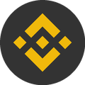
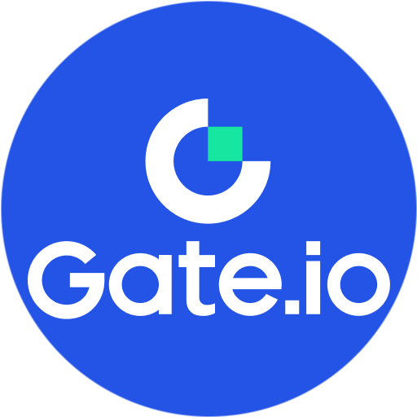

# HowToBeAKOL
如何成为一名成功的KOL

过去十几年里面，我们见证了一个全新的职业群体的快速崛起——KOL。

他们或许是一位美妆博主、一位游戏主播、也许是一名财经评论者，或者是普通人分享日常的生活片段的视频创作者。不管他们形式如何变化，有一点都是相通的，他们拥有了自己的独立影响力。

在我眼里，KOL!="网红"，不是因为有点讨论度，有点粉丝的人就是KOL，我眼中的KOL要具备三个核心能力：

- **内容的生产力**：持续创造有价值、有辨识度的内容。

- **品牌的构建力**：在纷繁复杂的平台环境中，形成独特而清晰的个人定位。

- **商业的整合力**：找到合适的变现模式，实现影响力与经济回报之间的平衡。

当然，成为KOL并不是一条轻松的道路。表面上的光鲜，背后往往是巨大的时间投入、不确定的收益，以及随时可能被遗忘的焦虑。正因为如此，这本书希望带给你的，不只是方法论，更是一种现实感：
你为什么想要成为KOL？你能承受什么代价？你打算如何在竞争激烈的流量漩涡中找到属于自己的位置？

我之所以想成为一名KOL，只是我自己对于我的职业规划，我本身作为一名"程序员"，职业生涯可能就不会太久，或许由于35岁的年龄限制，从而让我失去工作，当然我不是危言耸听，我在做的只是基于我自己的职业定位，还有为我自己的未来、为了我以后的家庭，以后的孩子，多做一个更充足的准备。万一我真的被裁员了，那么我也可以有别的一份收入来支撑我和我的家庭。又或者我多一份收入，那么对未来不可预知的风险，我也多了一份抵抗能力。

为什么是KOL，因为钱多事少，而且人更加地自由。你可以不用在公司里面，你做到内容可以在家里，可以在车里，可以在商场里，可以在咖啡馆里等等，只要能产出你所谓的"内容"就可以了。

综合我自己的情况，还有我自己的兴趣爱好，我想成为一名"WEB3"的KOL。说白了，就是钱多，而且自己也接触过币圈，看到了很多A8、A9的大佬们，甚至很多00后在里面也是混得风生水起。而我自己也坚信"去中心化"才是未来！

我会争取用高三那种拼命三郎的状态，来All IN WEB3，来学习模仿圈子里面的头部，争取有一天自己也能成为他们其中的一员，2025-09-14于深圳。

## 交易所
| [ 币安](https://accounts.binance.com/zh-CN/register?ref=896983517) | [ 欧意OKX](https://www.chouyi.pro/zh-hans/join/50253981) | [ ByBit](https://www.bybit.com/invite?ref=4VLKDMW) | [ 火币](https://www.htx.com.de/zh-cn/v/register/double-invite/?invite_code=xpi6a223&inviter_id=11346560) | [ bitget](https://www.bitget.com/zh-CN/) |
|:---:|:---:|:---:|:---:|:---:|
| [ CoinBase](https://www.coinbase.com/) | [ kraken海妖](https://www.kraken.com/) | [ KuCoin](https://www.kucoin.com) | [ 抹茶MEXC](https://promote.mexc.com/r/wIE7fPvG) | [ Gate.io](https://www.gatesee.com/signup/VLDFUFEOAW?ref_type=103) |

**❗❗️️❗一旦注册完成就不再会有永久减免的机会，注册时务必使用邀请码❗️❗️❗️**

| 名字     | 链接 | 功能描述     |
| :---        |    :----:   |          :--- |
| 币安    |   [https://www.binance.com](https://accounts.binance.com/zh-CN/register?ref=896983517)   | 邀请码：**zhuanmi**，币安交易所(持有bnb减免40%手续费)币安最近Alpha刷积分活动，空投每个月基本都可以领上万块，感兴趣可以看看[币安刷Alpha积分视频教程](https://www.youtube.com/results?search_query=%E5%B8%81%E5%AE%89alpha)|
| 欧易OKX    |   [https://www.okx.com](https://www.chouyi.pro/zh-hans/join/50253981)   |      欧易交易所(减免30%手续费)邀请码：**50253981** ，OKX Boost(20%减免手续费)邀请码：**ZHUANMI**|
| ByBit    |   [https://www.bybit.com](https://www.bybit.com/invite?ref=4VLKDMW)   |      ByBit交易所(减免30%手续费)邀请码：**4VLKDMW**|
| Bitget    |   [https://www.bitget.com](https://www.bitget.org/zh-CN/referral/register?clacCode=QR4A7MPY&from=%2Fzh-CN%2Fevents%2Freferral-all-program&source=events&utmSource=PremierInviter)   |      Bitget交易所(减免40%手续费)邀请码：**QR4A7MPY**|
| Gate.io    |   [https://www.gatesee.com](https://www.gatesee.com/signup/VLDFUFEOAW?ref_type=103)   |     Gate.io交易所(减免40%手续费)邀请码：**VLDFUFEOAW**|
| 火币    |   [https://www.htx.com](https://www.htx.com.de/zh-cn/v/register/double-invite/?invite_code=xpi6a223&inviter_id=11346560)   |      火币交易所(减免30%手续费)邀请码：**xpi6a223**|
| 抹茶    |   [https://www.mexc.co](https://promote.mexc.com/r/wIE7fPvG)   |      抹茶交易所(减免40%手续费)邀请码：**wIE7fPvG**|
| Web3撸空投  | [@tglukongtou](https://t.me/tglukongtou)             | 致力于为您提供每日更新的加密货币空投项目信息、保姆级撸空投教程、钱包安全指南与行业动态。空投官网：[web3.0xnav.com](web3.0xnav.com) twitter：[https://x.com/crypto_bxs](https://x.com/crypto_bxs)  |
| 加密货币交流群  | [@jmhbgroup](https://t.me/jmhbgroup)             | 一起交流加密货币相关内容，官网：[www.0xnav.com](www.0xnav.com)   |

## 基础篇

- [1、所需要的基础软件](./markdowns/基础篇/所需要的基础软件.md)

- [2、所需要掌握的基本技能](./markdowns/基础篇/所需要掌握的基本技能.md)

## 学习篇

## 进阶篇

## 实战篇